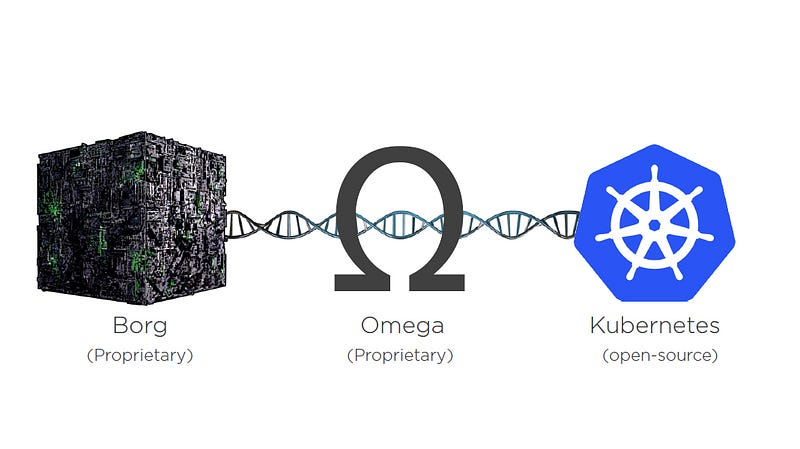
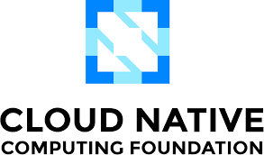

In the modern age, we are practically living off of digital data. All aspects of our lives from shopping, entertainment to education and information has been digitally integrated in one form or another. However, many of these services come from humble origins where the a handful of developers worked on an application which went on to serve millions of users per day. Have you ever wondered how that became possible?

In this article, we will talk about the thrilling story of the Kubernetes project, which was one of the critical projects that pushed the advances in cloud computing, ultimately creating the cloud-native ecosystem which unlike the olden times is not exclusive to large corporations but is rather available for developers around the world.

### What is Kubernetes?

Kubernetes is a container orchestration tool which allows developers to manage the deployment, communication and monitoring of containers deployments, secrets and other components in a container cluster. Kubernetes has enabled developers all around the world to easily deploy their applications on the cloud with the ability to distribute traffic evenly and scale the application instances in a matter of minutes to adjust to the demand of their applications.



Containers are nowadays a standard method of deployment of web applications on cloud infrastructures as they decouple the complexities of configuring the underlying infrastructure from the application code. However, this wasn’t always the case!

To emphasize the complexity of deploying an application on a machine, I think all developers can safely relate to the famous meme “It works on my machine”. Well, in the olden days this statement was a real problem rather than a funny meme!

### The Pre-Cloud Era

In the early 2000’s, the infrastructure and application deployment landscape for web applications was vastly different from what we see today.

Before the launch of early cloud providers such as AWS, most companies which needed to launch their web based applications had to deal with infrastructure allocation, maintenance and deployment themselves. This meant that the underlying hardware components such as the required CPU, storage and network resources had to be allocated by the organizations before launching their web application.

From a business point of view, this was an extremely costly venture as the allocation of hardware, compatible software and engineers to deploy the applications with the correct configurations for the underlying infrastructure was a mammoth expense, not to mention the on-going maintenance which would further incur costs.

### It works on my Machine!

One of the main reason of this huge expense was that once the infrastructure was allocated, optimally adjusting its usage to met the customer demand was practically impossible due to highly coupled design of the hardware and software. This meant that scaling the application accordingly to minimize the running costs was impossible.

Another important issue in this arrangement was the lack of configuration tools to optimally use the hardware. Every machine in the deployed cluster used the Operating System required by the application, and running multiple applications on the infrastructure to utilize the most of the hardware was not possible since the applications usually had unique and clashing configurations, settings and Operating System requirements. Even though the high coupling of hardware and software was later solved by virtualization technologies, configuring and orchestrating an environment for the application still proved to be a complicated task.

This was probably the most prominent time where the quote “It works on my machine” was used.

### The Big Player (AWS)

Around 2006, AWS started introducing the initial cloud offerings to the open market with the introduction of crucial services like S3 and EC2. Availing these services as enterprise solution for organization proved to be a huge market in the following years. Being the first player in the market, AWS had the opportunity to make its infrastructures battle-tested not only by its first-time enterprise clients before the cloud market was exposed to the common developer market after 2013, but also internally when while solving issues faced by their e-commerce platform between 2000–2003, hence making AWS extremely robust and developer friendly for the time.

With the years, AWS proved to become a reliable and persistent player in the cloud market, and other tech giants quickly started getting their eyes on the cloud market. Since AWS was the only major and reliable cloud enterprise solution at the time, companies like Google and Microsoft wanted to get a piece of this market, but the issue with this idea was the advancement of AWS. Unlike their competitors, AWS was significantly ahead of these companies in terms of technology expertise, ecosystem and developer connections, hence incremental development in their cloud offering was not a viable approach for any competitor to enter the market.

### The Borg Project

During the initial days of cloud services in 2003, when the Amazon team was developing services which eventually became AWS, Google was already working with some crucial products for the web such as the Google maps, Google news, Gmail and was planning to start development on Google Chrome search engine. They also had the expertise with containerization technology very early during the 2000’s due to contributions made to the ‘cgroups’ technology in the Linux operating system, as a result of which most of the technology stack being used at google was already what we call “cloud-native”.

Google developed and used in-house tools to manage, automate and deploy several cloud applications. One such tool is Borg, which is a container oriented cluster management system that Google used for its internal applications deployment on top of the LMCTFY container runtime, which is another in-house tool built by Google. Hence, although the cloud landscape was booming as Infrastructure as a Service (IaaS) came into the tech world, efficiently managing and configuring this infrastructure and applications running on it was still a hefty task for which Google had developed excellent tools.

Its is also important to note that while these tools existed within big corporations, mass developers still had no easy way to build and deploy applications while keeping them scalable on the cloud, since infrastructure provisioning, configurations and orchestration were still an unsolved problem for the masses.

### The fight for Open Source

With Google coming into the cloud computing market with their Google Cloud Platform in 2008, they quickly realised that incremental development on this platform was not going to be enough to capture a significant portion of this market. Google realized they needed to capitalize on the state of the art product line which was unique to them in the market — Google’s internal cloud toolchains.

Google was the pioneer of the initial container technology (Process Containers or CGroups) and was the contributor to the initial cgroups technology adapted by the LXC container runtime (Docker was later based on LXC). Being the pioneer and earliest adaptor of this technology meant that a vast set of tool chains had to be developed within Google.

Hence, even though they could not compete with AWS immediately on the level of infrastructure and breadth of services, Google came up with a unique approach to build a loyal customer base on its Cloud Platform.

Kubernetes was proposed to the higher executives as an open source version of the container orchestration tooling, which would take its roots from the internal container orchestration tool Borg. After facing considerable objections from the executives and several other obstructions, the initiative lead by like of Eric Brewer, Craig McLuckie and many other collaborators pushed Kubernetes to be an open source project, which saw a huge developer support and influx over the coming years.

Integration of Kubernetes with the GCP proved to be a driving factor in the rise of GCP as a prominent platform in the enterprise cloud space as the Kubernetes technology was the missing piece of the puzzle in the cloud space. Kubernetes enabled teams of all sizes to viably manage their applications on the cloud infrastructure with ease.

### CNCF

In 2016, Kubernetes officially became a part of CNCF, the Cloud Native Computing Foundation, whose goal was to provide a platform to many cloud based tools and projects which have the potential to transform the current cloud development ecosystem. Upon getting associated with CNCF, Kubernetes established itself as a global open-source project which saw a huge influx of developer contribution and adoption due to the increased trust and talent influx.

CNCF has since been successful in initiating and harboring several projects to enhance the Cloud Computing space such as Prometheus, FluentD, LinkerD, Opentelemetry, ArgoCD and many more.

### Success of the Open Source Model

Kubernetes holds a special place in the history of cloud space as it was one of the first products that adapted the open-source development model and lead it to success at a time when it was considered an unconventional approach. Kubernetes has become an excellent example of what a well executed and monitored open-source project can achieve.

This is the story of why we are able to run container clusters easily at scale in a modern and complex cloud infrastructure setting. Although the decision to open source a state-of-the-art technology was a risky one, the overall benefits of the initiative proved to surpass the consequences by a huge margin. I’d like to end this blog by mentioning a very well said quote by Sarah Novotny in Honeypot’s documentary on the history of Kubernetes: “Open Source is most successful when it’s played as a positive sum game”.

### Bibliography

[Kubernetes’s inspiration from Borg](https://kubernetes.io/blog/2015/04/borg-predecessor-to-kubernetes/)

[Kubernetes Documentary](https://youtu.be/BE77h7dmoQU)

[Origins of AWS](https://techcrunch.com/2016/07/02/andy-jassys-brief-history-of-the-genesis-of-aws/)

[Architecture of Borg](https://research.google/pubs/pub43438/)

[LXC vs Docker](https://www.upguard.com/blog/docker-vs-lxc#:~:text=Docker%20is%20developed%20in%20the,provided%20by%20the%20underlying%20infrastructure.https://www.upguard.com/blog/docker-vs-lxc#:~:text=Docker%20is%20developed%20in%20the,provided%20by%20the%20underlying%20infrastructure.)
