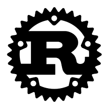
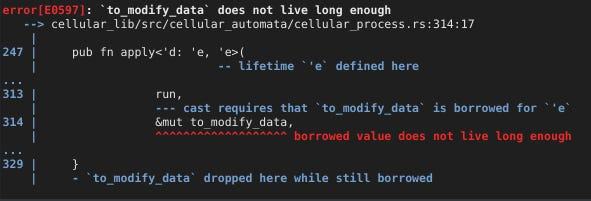
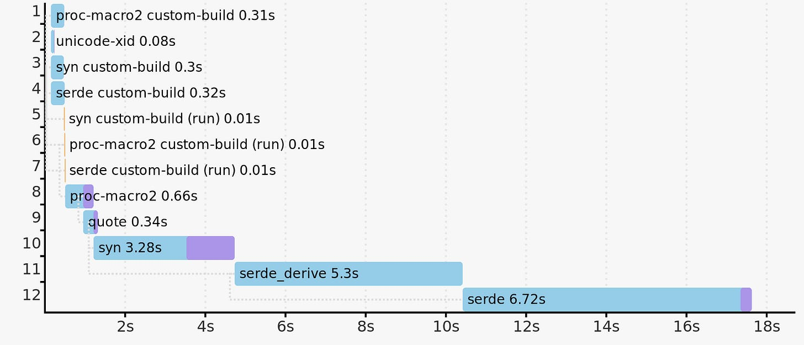
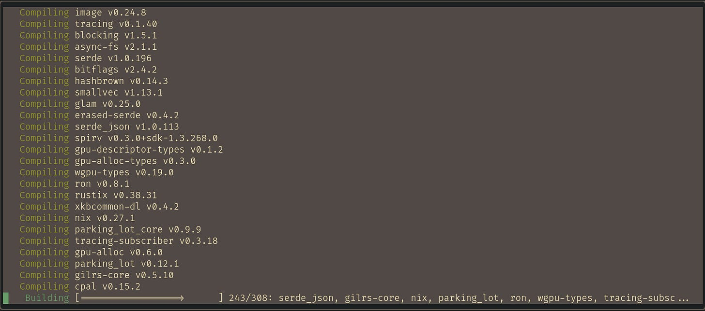
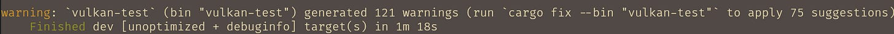
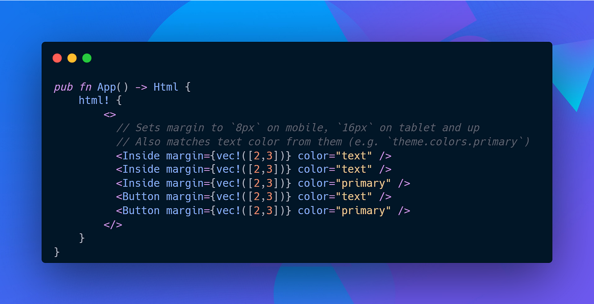

# Rust’s Proposition

Rust is a low-level programming language which was released in 2015 and is seeing increased adoption across various industries and applications. It has gained popularity for being an efficient alternative to garbage collected languages in several use cases (such as Discord) where performance and safety are considered critical for operations, and is also gaining popularity in mainstream projects such as the Linux kernel.

One of the main factors which sets rust aside from mainstream language choices for systems programming such as C or C++ is its drastically different approach to enforce safe patterns on programmer by using the borrow checker. In laymen terms, the borrow checker is a compile time static analyzer which ensures that there is only ever one variable which references a given memory location, and that the memory is freed once the lifetime of the variable ends. There is obviously much nuance involved, but we wont discuss it here to keep this as concise as possible. This approach in theory should completely remove the possibility of memory leaks in programs, enabling programmers to write “safe code”.

With an ever growing community (which is also extremely vocal for rust) and language features, rust seems like a promising alternative to shift low-level workloads into a safer environment. But does it really live up to its name?

## My Background

To explore this language, I went on to learn rust with the ultimate aim of learning Vulkan graphics API and using it to create a game engine. Now, to better justify my views in the following sections of this article, I think its necessary for me to disclose my previous experience and background in software development.

I started programming by learning C++ and went on to acquire a thorough grasp on language, the memory concepts involved in a computer OS, and how it effects the various aspects. It was also this environment which helped me in understanding the internals of computer system architecture and how it relates to our programs. Over the years, I have experimented with many frameworks and domains in C++ ecosystem, ranging from low-level graphics programming, frameworks such as SFML and SDL, POSIX bindings, to HPC frameworks such as OpenMP and CUDA.

Nonetheless, I can safely say that C++ and low-level environment with full control of my program is my preferred choice for software development, and hence I have spent considerable time learning the nuances involved in low-level systems programming.

However, the design paradigm proposition offered by rust was something that I had never seen before, so I knew that this would be a steep learning curve, and that some time had to be allocated to properly analyze the pros and cons of using rust in projects.

## Rust Propositions in Reality

Let’s start by highlighting some important features pitched by the rust language that are different from other systems programming language alternatives, and then I’ll try to highlight exactly how those features play a role in practice

A high-level overview of the system architecture. _Key components_ are highlighted.

### References, Lifetimes and the Borrow Checker

In rust, we don’t really have any access to heap memory directly in a variable. That means that any variable that we use is just a variable allocated on the stack. We can use structures like `Box<T>` which allow us to allocate memory on the heap, while accessing them using the box instance variable, which itself has been allocated on the stack. When this box instance runs out of scope, it is dropped and the heap memory allocated by the variable is freed.

Hence, all variables in the rust just reference a certain memory location on the stack. However, creating references to these variables brings about some tricky nuances. Rust references are carefully designed in a manner which ensures that the memory that the reference point to does not suffer through a data race condition due to multiple references modifying the value at the same time.

To solve this issue, rust only allows one of the 2 types of references under only the corresponding conditions:

  1. Mutable references are given only when there are no other active mutable or immutable reference for the variable being referenced

  2. Immutable references are given only when no mutable reference exists for the variable being referenced

What this means is we can either have any number of immutable references, or only one mutable reference to any variable in rust, but not both. Although this paradigm inspired by rust’s core philosophy may be successful in ensuring safe code for references, it also restricts us from writing code in paradigms which would actually have been safe.

To further ensure safety of references, each reference carries a “lifetime” with it in its propagation or storage across the code base (the concept also applies to variable, but is more explicitly handled while dealing with references). This lifetime is the lifetime of variable that the reference points to. This enables rust to check the validity of any references in the code during compile time, hence rust only allows references which live at least as long as the lifetime of the reference. This concept of lifetime is extremely nuanced, with features life covariance, invariance and contravariance (read more) which govern the rules of lifetime subtyping.

A brief look at simpler lifetime errors in Rust

These nuances in the concept of lifetimes present some extremely weird challenges where even though the code being written is safe, it becomes impossible to satisfy the borrow checker on the validity of the references. I personally ran into issues with references so much so that I have now made it a general rule of thumb while programming in rust to avoid storing references or using them excessively whenever possible.

Although this may serve some applications very well, I personally did not see the appeal of restricting the programmer from writing safe code. This issue is one of the many in rust where the borrow checker is unable to detect safe code. It would also be incorrect to blame the rust language developers for this, since detecting whether a given code is safe or not using static analysis techniques follows a conservative approach, and hence it is a better trade off to reject a valid code rather than to accept invalid code. However as a programmer who uses the language, it is hard to ignore this extremely restrictive feature which often hinders with the flow of development

The astonishing thing here is that the rust doc advocates for this issue by saying: “more experienced Rust developers report that once they work with the rules of the ownership system for a period of time, they fight the borrow checker less and less” (<https://doc.rust-lang.org/1.8.0/book/references-and-borrowing.html>).

To justify the “rust” way of doing things this way, there have been several arguments made across various talks and conferences by experts across various fields. Many advocates of rust make an argument that this restriction enforced by rust actually forces the programmer to adapt approaches (data driven, composition, etc. This is another deep subject to be covered some other time) which are anyways better than what their object oriented alternative would have been.

Again, not to challenge the approach for suitable applications, but I genuinely don’t believe that restricting the developer from following certain design paradigms is the solution to the problems. It just makes the “symptoms” of the problem reach a less chronic state by making the issue very visible during development itself to prevent further catastrophe. As engineers, I believe that we must be aware of all dimensions of our decisions, and deeply understand the issues and rewards of our solution and then make an informed choice about the type of design that we follow. There is no right answer to some problems in engineering, and some design decisions might be right which may not be right according to the mainstream developers. Rust on the other hand forces the programmer to follow a certain style of programming, which can be restrictive for writing programs outside of that paradigm, or might require complex system implementations, which in real world scenario have serious business implications such as cost or time of development, which can lead to severe problems in a product life cycle if not handled in a well informed way.

### Explicit Nature

Rust follows a philosophy of being explicit in nature, due to which rust does not allow for some common things like function overloading, and is extremely explicit in many operations such as cloning variables in the code base. By default, no type other than the primitives are copied implicitly, and if we want our structures to have implicit conversion, we must define the behavior by implementing the `Clone` and `Copy` traits.

One issue that I personally experienced which might arise from this explicit nature is something called “clone flooding”, where the programmer, in an attempt to satisfy the borrow checker to allow them to transfer memory across code base in a convenient manner might simply apply the clone operation to the variable. If the programmer does not mitigate these issues, it might lead to very high memory usage and can even cause the program to slow down, since part of the code base are busy in copying big chunks of memory which should simply have been read through a reference. I personally faced this problem especially while passing around vectors to create Vulkan based buffers in the Host or Device memory.

I personally do not feel this explicit nature is a bad thing, but rather an extremely important and beneficial feature of rust, as it enables us to explicitly identify points in our code where the memory shoots up, without hiding the issue under “invisible” language features (C++ folks know what I’m talking about :’) ).

Even things like unsupported overloading can be beneficial since the programmer is forced to adapt appropriate naming conventions for functions and specify the differences across various access points in the interface, which makes the general code reading experience smoother for someone reading and exploring an unknown code base. Also, the `unwrap` keyword explicitly lets the developer know that they have to be fine with the program crashing, which in turn helps the developer consider cases for handling panic situations under various circumstances.

### Toolchains: The Heavy Cargo and Rust analyzer

Unlike other popular systems languages like C++, where dependencies have to be manually managed by the developer, rust comes with a package manager called “cargo” which is the primary tool that we as developers interact with while working with rust code. Cargo is responsible for identifying the required dependencies added to our projects, fetching them from the cargo repository [crates.io](http://crates.io), and adding packages into our project.

Unfortunately, that is all the good things I have to say about cargo, and I think even the rust community would largely agree with the problems I am about to point out with the cargo package manager. The issues with cargo package manager link deep down to the lack of a stable ABI for rust, which we’ll discuss at length.

The Rust programming language, as of the time of publishing of this article, does not have a stable Application Binary Interface, or ABI. What this essentially means is that we cannot dynamically link libraries into our application which were compiled on older versions of the rustc compiler.

In C++, we could simply link a library through a .dll, .so file (depending on the OS) no matter what compiler that library was compiler on, and still be sure about the correctness of the binary code produced as the final application output. This is because C++ has a stable ABI, and ABI breaks in C++ are a rare event (The last ABI break in C++ was in C++11). This allowed developers to freely use pre-compiled libraries in their applications, which meant that these dependencies need not be compiled along with the application code, and could be kept as a separate module which could be loaded statically or dynamically, depending on the choices made by the programmer.

However, the Rust ABI is not guaranteed to be stable across compiler versions. What this means is that a library compiled in version 1.0 if used an older compiler, then the static or dynamic library files generated by them could not be correctly used in applications which compile on later compiler versions to use the latest features. Due to this reason, the Rust cargo package manager is forced to actually download the source code of the crate being used in the application and compile it along with the application in order to use it.

Build graph of a crate building its dependencies

Although this solves the issue of compatibility, it gives rise to a much more serious issue: Compile times and resource usage. In my experience, an average cargo package which does not use much resources in terms of dependencies can still comprise of more than 60 dependencies. A moderate sized project might see this go up to 150-200 dependencies, while large projects will see a much higher count of dependencies.

Compilation of the entire source code for the bevy game engine can go upto 308 dependencies, which take a huge amount of time to compile from scratch.

The cargo package manager now has a mammoth task of building all the dependencies required for the application from the ground up and then linking them into the application binary. This increases compilation time of the entire project by a enormous amount. I cannot stress enough on the problems that this high compile time can end up causing to the development process when coupled with the borrow checker issues. Personally, a severe hit on performance in exchange for some comfort in installing packages is not a good deal.

From a clean build, the project with 3-4k lines of code takes more than a minute for a clean build, where dependencies like serde are installed as libraries on the system.

If this was not enough, currently the default and unfortunately the most feature rich Language Server Protocol (LSP) offered by rust, which is called the rust-analyzer is capable of single-handedly crashing some PCs if not slow them down. I have personally not seen the rust-analyzer occupy less than 900mb of RAM memory per environment that I open in vs-code, and in most cases its memory usage exceeds more than a GB or RAM. In such cases, I cannot even imaging opening more than 2 rust projects at the same time from different instances of my text editor without facing serious lag issues. The rust-analyzer can take less memory in editors like neovim, but its memory usage is still nowhere in the acceptable range. On top of this, it is consistently slow and filled with bug in IDEs like vs-code. This kind of bloatware in the name of a development tool causes extreme unreliability and frustration in the development process, which can make working with Rust all the more difficult.

### Ecosystem: Support and Communities

Rust is a relatively new language, and therefore in absolute terms, it is far behind languages like C, C++, etc which have had a huge community base with battle tested and matured projects which are currently deployed in many mission critical applications. But to be honest, comparing the rust ecosystem which is barely 9 years old to a ecosystem which has been evolving since the 1970s is kind of far fetched.

Even though rust has a steep learning curve, rust has witnessed a remarkable penetration in terms of usage adaption and library ecosystem support. With libraries ranging from asynchronous runtimes(tokio), webservers(axum), embedded applications to large application and low-level libraries such as physics engines, game development frameworks and bindings for low-level graphics APIs such as Vulkan and Metal, rust has seen incredible adaption and community support in open source venues and platforms.

That said, it is still a fact that rust is still behind other options in terms of stability of many of these libraries. Along with this, many of the libraries might be poorly documented by [crates.io](http://crates.io) since they are auto generated with rust clippy, where documentation might not be as guided as a dedicated guide and reference page might be. However, it is still a help in terms of having a bare bones code exposure as it lists all the methods and member fields in a struct and their use cases if the developer has at least put in some code based documentation.

One critical issue that might effect developers in the rust ecosystem is the lack of interoperability. As mentioned above that due to a lack of ABI, rust is not stable while working with pre-compiled libraries of rust code written on previous compilers. However, rust has good interoperability for the C language and is able to interact with the C ABI comfortably. Unfortunately, this is (kind of) the limit of Rust’s interoperability as of now, since Rust is not able to work very well with other ABIs such as that of C++. Though there have been attempts to create interface for rust with other languages, currently the state of interoperability in Rust with any language other than C is at a very premature stage. Although compatibility with the C ABI in theory should mean that it could interoperate with any binary based runtime, this inference is not really practical since the process of converting a C library into a rust interface can be a tricky affair depending on situations.

But there is good news here as well! Very recently Google decided to invest $1 million in the rust foundation to encourage them to increase interoperability with C++, since many google apps developed on the Android NDK using C++ suffer from memory bugs, and Rust could potentially provide a good alternative to android developers. Hopefully this could enable a large influx of resources and libraries into the Rust ecosystem, hence improving interoperability. C++ is a language which has many interoperability tools developed for its ecosystem over the years. This could benefit the Rust ecosystem tremendously.

Overall, although the rust ecosystem is not at par with the industry standards just yet, it is getting closer to it day by day and it shows huge potential of expanding mass adaption in the coming years.

### On Safety

The most important and highlighted feature in Rust is its emphasis on safety. The notion that code written in “safe” rust has no scope of having memory leakages and therefore leads to better software quality is pretty popular. Even in situations where it is necessary to use unsafe methods, rust allows the `unsafe` keyword to help the developer pin point the potential issue in the code base to decrease effort. But is this proposition really true in reality?

To make my case, I’d like to reference an amazing blog by [notgull](https://notgull.net/cautionary-unsafe-tale/) where he encountered an alignment bug in a dependency crate, even though the code in the dependency itself was not incorrect. The bug originated due to miscalculation (due to architecture upgrades) in the safe part of the code, which in turn caused the unsafe code to become unsound. This entire blog (and scenarios I personally encountered while programming) made me realize a very important fact: We cannot blindly depend on safe code to be completely safe and say that we need to focus only on the unsafe code to ensure safety guarantees. This is a critical nuance which has been mentioned even in the Rustonomicon: the fact that safety is [non-local](https://doc.rust-lang.org/nomicon/working-with-unsafe.html) is a very important factor while writing unsafe rust code. The state changes in any safe portion of the code can propagate into unsafe blocks and make the unsafe block unsound. Since this propogation did not originate in the “unsafe” code, detecting origin points of such bugs can become extremely challenging in some cases.

So to make my point, simply using rust cannot be perceived as writing safe programs. **Rust is not a safe language** when your application is big enough and you’re forced to work with underlying APIs on your own. This might seem like a trivial argument to some, but it is extremely important. While designing and working with systems on a low enough level, we are eventually forced to use OS specific libraries or libraries outside the rust ecosystem which might behave in manner which is not suitable for the rust environment, and hence any state propagation to and from such APIs or dependencies have to be analyzed with utmost care, hence bringing back the problem of “unsafe” code in the picture.

Subscribe

## Strong points of Rust

Although there are many issues with rust which make it hard to adapt it with ease, it would be extremely unfair to leave out the fact that the language does offer some very real and practical merits while developing software.

### Meta programming

In laymen terms, Meta programming is a branch of programming where the code we write in turn generates code in the program based on some state of the code supplied to it. It is extremely important and a very powerful tool since it allows us to reduce repetition while also giving us the flexibility to write specialised code for specific types.

Code snippet of Yew.rs (source: whoisryosuke.com), showcasing the power of rust metaprogramming

Rust with its macro based meta programming tooling offers one of the strongest meta programming support I have seen across different languages. With the kind of abilities macros is able to provide developers, people have created DSL (Domain Specific Languages) that can enable people to write parsers to convert code written in another language into valid Rust code. This incredible ability has allowed the Rust ecosystem to get a solid foot in domains like web based frontend technologies with frameworks like [Yew.rs](https://yew.rs/) creating alternatives to javascript based frameworks such as React.

### Safety as an Intrinsic Thought

Even though Rust is clearly not a “safe” language in literal terms as explained in the sections above, it does offer one thing that no other language on the market does: Thinking about safety. Yes, even though it sounds more like a developer’s orientation rather than a language feature, it is true in my experience that Rust enforces the developer to think about the code they have written. Especially when the developer is forced to write the “unsafe” keyword, a subconscious thought is forced in the developer which tries to understand the nuances involved in the unsafe code block.

Although this may seem more like an intrusion in the flow of writing software to some (which is definitely true to some extent), it would also be foolish to refuse the argument that many of these “unsafe” code bases which the high level developers blame on C raw pointers simply exist because the developers got leeway to be lazy while designing a software in an already complex setting and environment, while other exist due to the abstraction of memory and architectural details of the system by these tools that are supposed to “reduce the time to market”.

Rust is a programming language which is designed in a philosophy which aims to solve from this very crucial problem, and hence introduces the importance of understanding software complexities as a requirement to the developer rather than making it optional.

### A Force for Data Driven Designers

Rust has a starkly different memory model and language philosophy compared to its alternative languages popularly used. This difference has very real roots originating from the problems caused due to Object Oriented Design. For many years dating as long back as the 1980s, the paradigm of Object Oriented has been propagating through the market, with many languages such as Java, C++, Python, Smalltalk providing features to developers with the proposition of lowering the time required for software to make it to the market.

However this belief structure built around the Object Oriented world has introduced a new layer of complexity into the world of software design, where developers are often forced to design a solution around this approach, rather than the object oriented approach being a useful tool used to solve a suited problem. As a result, over the years a high number of degraded software products have flooded the software market simply due to poorly designed solutions around Object Oriented concepts. To further accelerate this issue, the lack of knowledge of the underlying system and its memory due to the abstractions being introduced in language designs and tools have further pushed developers to a point of compromising software quality for the sake of development ease.

In such cases, the original data driven approach has made a comeback where the solution to the real problem was more important, which is driven by data in any electronic system. Rust is a language which is naturally designed around this philosophy, and hence makes it essential for the developer to focus on a Data Driven approaches towards a problem rather than being stuck in the traditional object oriented pattern. Rust even penalizes the developers in many instances for choosing to implement an inefficient design paradigm.

Such a paradigm is especially useful in domains where the highest possible performance extraction from the underlying system is critical for software because it helps us remove the abstraction cost caused by using features such as dynamic dispatch only when required. It also saves us from complicated code management issues such as “the diamond problem” and “getter/setter flooding” in classes. The separation between data and logic is a consistent and primary theme for a developer programming in Rust, and even though this can have its own struggles, it helps the developer built quality software in the long run.

### Conclusion

Rust is a good language which currently suffers heavily from its toolchain ecosystem, where interoperability issues due to lack of ABI support can add to the problem. In such a scenario, further struggles with the borrow checker that the programmer constantly faces certainly don’t help. As highlighted above, there are certain situations where the rust paradigm of safety interferes with actually safe code, or in some cases prevents us from using features which might be necessary. It forces the programmer to specific styles of writing code, which may help in writing secure code in some situations, but greatly hinders with the programmers ability to write code in different patterns and designs, and leads to increased time of development and higher costs. It reminds me of a good saying used in the world of cyber security: “The safest house on the block is the one which has no doors and no windows”.

But it would be futile to say that rust is not a good language. It shows a lot of promise, and does not suffer from the bureaucracy of the C++ standards committee and backwards compatibility issues. It is built on a philosophy which is built on very real problems faced in software world and does not cost the developer in terms of performance. However in my experience, the entire ecosystem along with the toolchain and the language itself still needs a lot of work for practical use cases. Although new efforts have been made to make interoperability feasible, it still has a long way to go.

At the end it is important to remember that any programming language is a tool which enables us to develop software for real world applications, and selecting the wrong or limiting tool can hurt us in the long run. Rust is good for some applications, and carefully analyzing the pros and cons of this language is essential before making any decision. If strict patterns and high compile times are not a problem, rust might actually be a good choice, but if not, I think there are better options out there. Whatever you choose, unless its not Javascript, Typescript or PHP, you’re gonna be fine!

